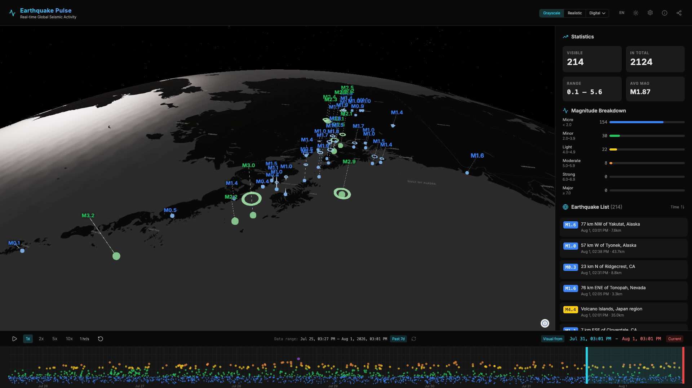
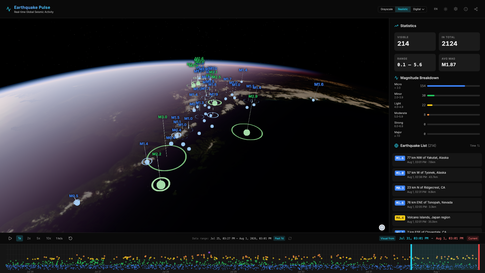
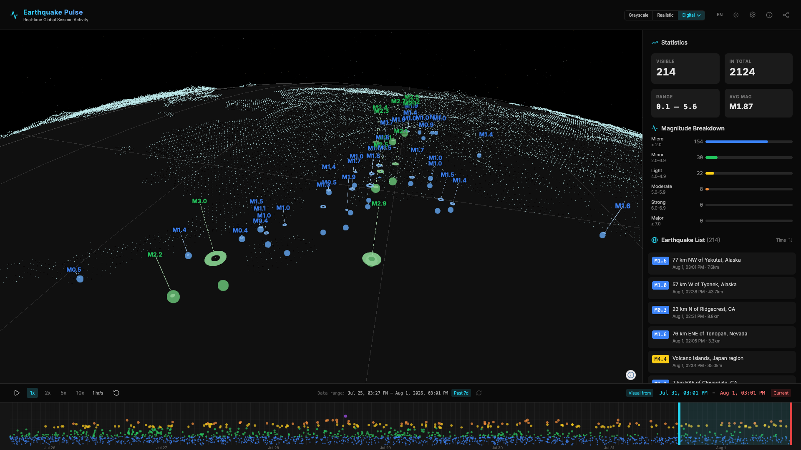
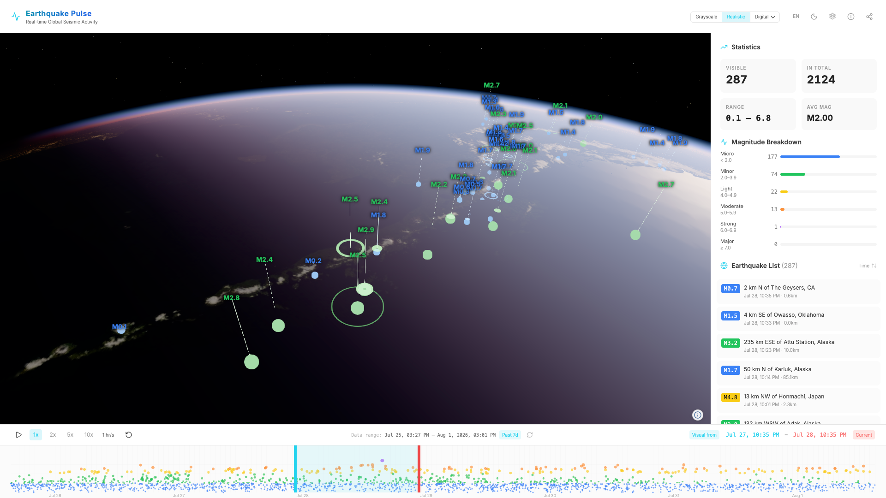

# Earthquake Pulse

Real-time global seismic activity visualization powered by [Navara](https://github.com/reearth/navara) 3D globe engine and [USGS](https://earthquake.usgs.gov/) earthquake data.

## Quick Start

```bash
pnpm install
pnpm run dev
```

Opens at `http://localhost:8080`.

## Screenshots

| Grayscale | Realistic |
|:---:|:---:|
|  |  |
| **Digital** | **Light Theme UI** |
|  |  |

## Features

- **Time Range Selector** — Choose Past 7 days, Past 24 hours, or Fixed from Sharing to control data scope. Refresh button to re-fetch.
- **3D Visualization** — Magnitude-based color-coded spheres, depth indicator cylinders, seismic wave ring animations on a 3D globe.
- **Timeline** — Draggable cyan (range start) and red (current time) handles, pan the window, play/pause playback at 1–10× speed, reset to defaults.
- **Statistics Panel** — Live magnitude breakdown, event counts, earthquake list sortable by time or magnitude.
- **Visual Modes** — Switch between Grayscale, Realistic, and Digital (point-based globe) via the header toggle. Adjust terrain exaggeration (1–100×) from the Digital dropdown.
- **Share View** — Generate a shareable link encoding camera position, timeline range, and settings. Loading the link restores the exact view and fetches the same time range from USGS.
- **Interactive Map** — Click earthquakes or labels to view details; click empty space to dismiss.
- **Dark/Light Theme** — Toggle in the header.
- **i18n** — English / Japanese language toggle.

## Tech Stack

| Layer       | Technology                                |
| ----------- | ----------------------------------------- |
| 3D Engine   | [Navara](https://github.com/reearth/navara) |
| Rendering   | Three.js                                  |
| UI          | React 19 + shadcn/ui + Tailwind CSS       |
| Data        | USGS GeoJSON Feed + FDSN Query API        |
| Build       | Vite + TypeScript                         |
| i18n        | i18next + react-i18next                   |

## Project Structure

```
src/
├── main.tsx                              # Entry point, view setup, data loading, state orchestration
├── App.tsx                               # React UI (header, sidebar, timeline, share/info modals)
├── i18n.ts                               # EN/JA translations
├── modules/
│   ├── viewSetup.ts                      # Navara view, plugins, basemap, terrain, plates
│   ├── earthquakeData.ts                 # Data loading, GeoJSON factory, visibility filtering
│   ├── earthquakeVisualization.ts        # GeoJSON layers, depth cylinders, overlay labels
│   └── waveSetup.ts                      # Seismic wave ring animation
├── descriptors/
│   ├── SeismicWaveDescriptor.ts          # Custom Navara MeshDesc for wave rings
│   └── DigitalGlobeDescriptor.ts         # Point-based digital globe (3 LODs, height-colored)
├── components/ui/                        # shadcn/ui primitives
├── utils/
│   ├── earthquakeDataFetcher.ts          # USGS summary feed + FDSN query API client
│   ├── earthquakeHelpers.ts              # Statistics calculator
│   └── magnitudeClassification.ts        # Magnitude color/size classification
└── types/
    └── earthquake.ts                     # TypeScript interfaces
```

## Generation Script

`scripts/generate-land-points.ts` is an offline tool that samples Natural Earth land polygons + Mapzen terrain elevation to produce the digital-globe point binaries in `public/`. Run with `pnpm generate:land`. See [docs/digital-globe.md](docs/digital-globe.md) for details.

## Magnitude Classification

| Name     | Range    | Color             |
| -------- | -------- | ----------------- |
| Major    | ≥ 7.0    | Red `#EF4444`     |
| Strong   | 6.0–6.9  | Purple `#A855F7`  |
| Moderate | 5.0–5.9  | Orange `#FB923C`  |
| Light    | 4.0–4.9  | Yellow `#FACC15`  |
| Minor    | 2.0–3.9  | Green `#22C55E`   |
| Micro    | < 2.0    | Blue `#3B82F6`    |

## Usage

- **Drag** to rotate globe · **Scroll** to zoom
- **Click** earthquake markers or sidebar items to view details · click empty space to dismiss
- **Timeline** — Drag cyan handle (range start) / red handle (current time), drag the highlighted area to pan, press Play to animate, ↺ to reset
- **Data range** — Select past 7 days, past 24 hours, or a fixed shared range from the header dropdown; ↻ to refresh
- **Visual modes** — Grayscale / Realistic / Digital toggle in the header; use the ▾ on Digital to adjust terrain exaggeration
- **Settings (⚙)** — Toggle tectonic plate boundaries
- **Share (↗)** — Copy a link that restores the current camera, timeline, and settings
- **Info (ℹ)** — Feature overview and links
- **Theme (☀/🌙)** — Switch between dark and light mode
- **Language** — Toggle EN / JA in the header

## Data Sources & Attribution

| Data | Source | License |
|---|---|---|
| Earthquake events | [USGS Earthquake Hazards Program](https://earthquake.usgs.gov/) | Public Domain |
| Tectonic plate boundaries | USGS — Bird, P. (2003) | Public Domain |
| Land boundaries | [Natural Earth 1:110m](https://www.naturalearthdata.com/) | Public Domain |
| Terrain elevation | [Mapzen Terrarium Tiles](https://github.com/tilezen/joerd) | CC-BY 4.0 |
| Satellite imagery | [Re:Earth Papers](https://papers.reearth.land/) | — |
| Terrain mesh | [Re:Earth Terrain](https://terrain.reearth.land/) | — |

## License

Dual-licensed under Apache 2.0 or MIT at your option.
