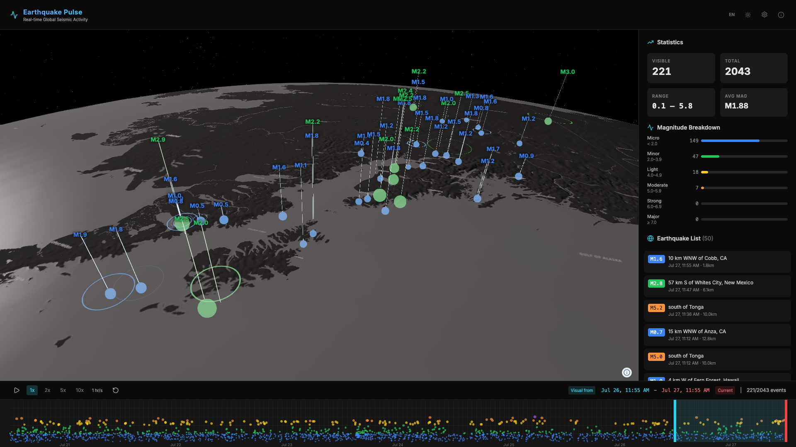
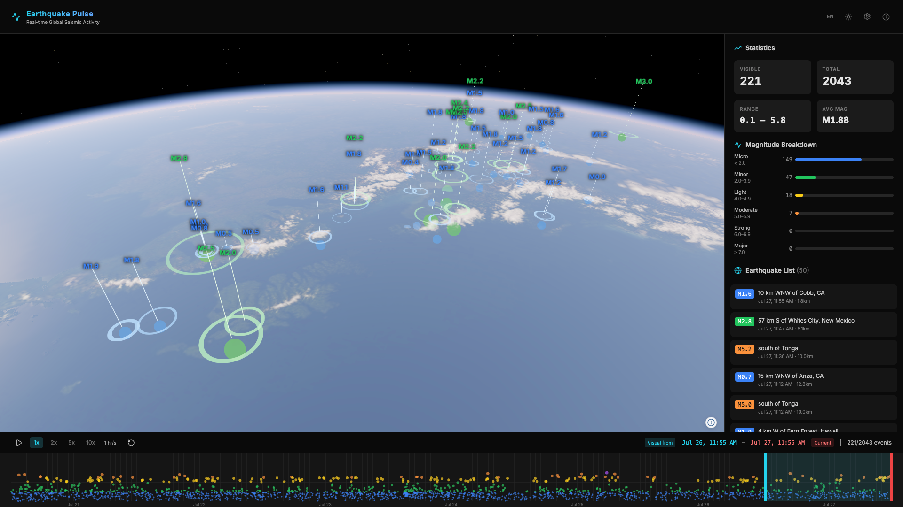
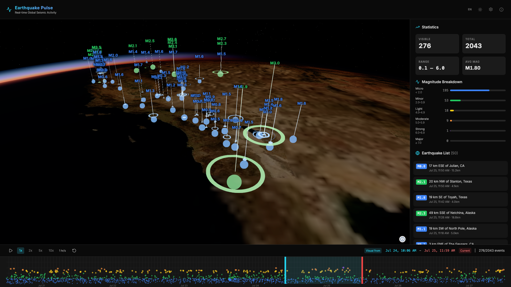
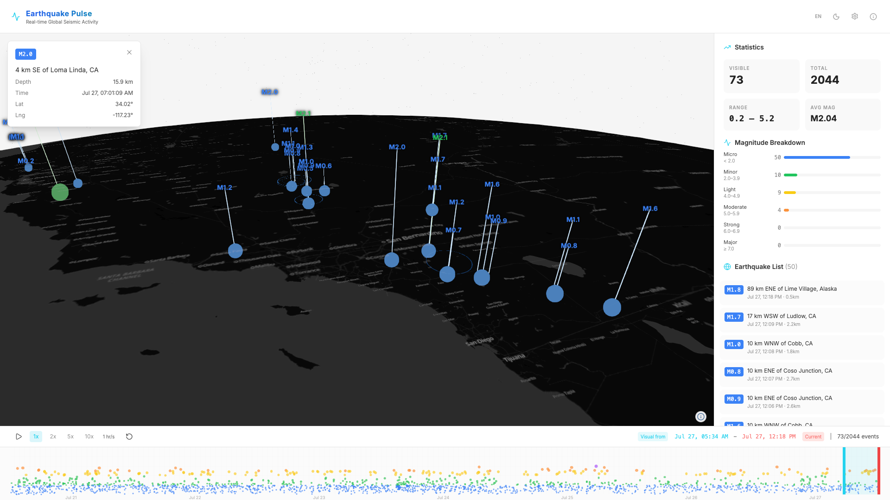

# Earthquake Pulse

Real-time global seismic activity visualization powered by [Navara](https://navara.app/) 3D globe engine and [USGS](https://earthquake.usgs.gov/) earthquake data.

## Quick Start

```bash
pnpm install
pnpm run dev
```

Opens at `http://localhost:8080`.

## Screenshots

| Grayscale | Realistic |
|:---:|:---:|
|  |  |
| **Realistic 2** | **Detail** |
|  |  |

## Features

- **Real-time Data** — USGS Earthquake Hazards Program API, all magnitudes, past 7 days
- **3D Visualization** — Magnitude-based color-coded spheres, depth indicator cylinders, seismic wave ring animations
- **Timeline** — Range selector with draggable start/end handles, play/pause playback at 1–10x speed
- **Statistics Panel** — Live magnitude breakdown, event counts, earthquake list sorted by time
- **Dual Visual Modes** — Realistic (Blue Marble + atmosphere) and Digital (grayscale + no atmosphere)
- **Tectonic Plate Boundaries** — Toggleable overlay with USGS plate boundary data
- **Interactive Map** — Click earthquakes or labels to view details, click empty space to dismiss
- **Dark/Light Theme** — Toggle in header

## Tech Stack

| Layer | Technology |
|-------|------------|
| 3D Engine | [Navara](https://github.com/reearth/navara) (`@navaramap/three`) |
| Rendering | Three.js |
| UI | React 19 + shadcn/ui + Tailwind CSS |
| Data | USGS GeoJSON Feed |
| Build | Vite + TypeScript |

## Project Structure

```
src/
├── main.tsx                              # Entry point
├── App.tsx                               # React UI (layout, sidebar, timeline, modals)
├── modules/
│   ├── viewSetup.ts                      # Navara view, plugins, basemap, terrain, plates
│   ├── earthquakeData.ts                 # USGS API, GeoJSON factory, range filtering
│   ├── earthquakeVisualization.ts        # GeoJSON layers, depth cylinders, overlay labels
│   └── waveSetup.ts                      # Seismic wave ring animation
├── descriptors/
│   └── SeismicWaveDescriptor.ts          # Custom Navara MeshDesc for wave rings
├── components/ui/                        # shadcn/ui primitives
├── utils/
│   ├── earthquakeDataFetcher.ts          # USGS API client
│   ├── earthquakeHelpers.ts             # Statistics calculator
│   └── magnitudeClassification.ts       # Magnitude color/size classification
└── types/
    └── earthquake.ts                     # TypeScript interfaces
```

## Magnitude Classification

| Name | Range | Color |
|------|-------|-------|
| Major | ≥ 7.0 | Red `#EF4444` |
| Strong | 6.0 – 6.9 | Purple `#A855F7` |
| Moderate | 5.0 – 5.9 | Orange `#FB923C` |
| Light | 4.0 – 4.9 | Yellow `#FACC15` |
| Minor | 2.0 – 3.9 | Green `#22C55E` |
| Micro | < 2.0 | Blue `#3B82F6` |

## Usage

- **Drag** to rotate globe · **Scroll** to zoom
- **Click** earthquake markers or labels to view details
- **Timeline**: Drag cyan handle (range start) and red handle (current time), drag middle to pan window, press Play to animate
- **Settings (⚙)**: Toggle plate boundaries and realistic mode
- **Info (ℹ)**: Project introduction and usage guide
- **Theme (☀/🌙)**: Switch between dark and light mode

## License

Dual-licensed under Apache 2.0 or MIT at your option.
